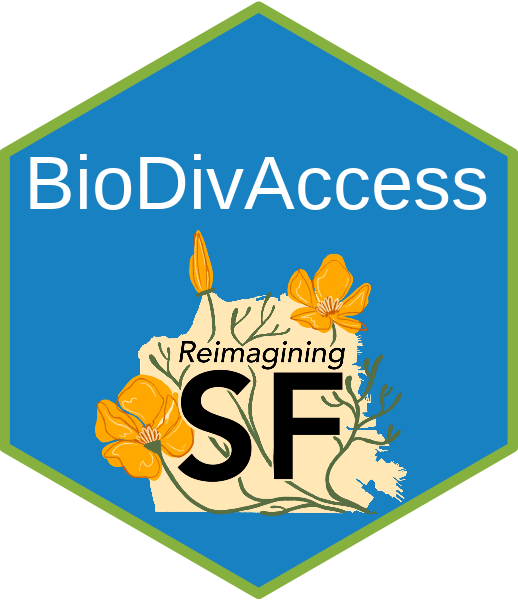

# SF Biodiversity Access Shiny App

This Shiny app provides decision support for the **Reimagining San Francisco Initiative**, aiming to explore the intersection of biodiversity, socio-economic variables, and greenspace accessibility.

---

## Features

- Users can either **click on the map** or **type an address** to generate isochrones for travel-time accessibility.
- Supports multiple transportation modes, including pedestrian, cycling, driving, and traffic-sensitive driving.
- Retrieves socio-economic data from **precomputed Census variables**.
- Calculates and overlays **NDVI** for vegetation analysis.
- Summarizes biodiversity records from **GBIF** and identifies species richness, greenspace, and socio-economic patterns.

---

## App Summary

This application allows users to:

- Generate travel-time isochrones across multiple transportation modes.
- Retrieve biodiversity and socio-economic data for a chosen area.
- Explore greenspace coverage, population estimates, and species diversity.

**Created by:**
Diego Ellis Soto. In collaboration with Carl Boettiger, Rebecca Johnson, Christopher J. Schell  
Contact: diego.ellissoto@berkeley.edu  

---

## Why Biodiversity Access Matters

Ensuring equitable access to biodiversity is essential for:

- **Human well-being**: Promoting physical and mental health through exposure to nature.
- **Ecological resilience**: Supporting pollinators, moderating climate extremes, and enhancing ecosystem services.
- **Urban planning**: Incorporating biodiversity metrics into decision-making for sustainable urban futures.

---

## Next Steps

1. Add impervious surface data, national walkability score, and social vulnerability index.
2. Integrate community organizations and NatureServe biodiversity maps.
3. Optimize speed by pre-storing variables and aggregating data.
4. Develop a comprehensive biodiversity access score in collaboration with stakeholders.
5. Annotate GBIF data with additional environmental variables for enhanced summaries.

## Public Transport Data

Future plans include integrating public transportation accessibility to further enhance decision-making capabilities.

---

## Repository Structure

- **App.R**: Main application file containing UI and server logic.
- **R/setup.R**: Script to load necessary datasets (e.g., annotated GBIF, NDVI).
- **www/**: Contains logos, screenshots, and other resources.

---

